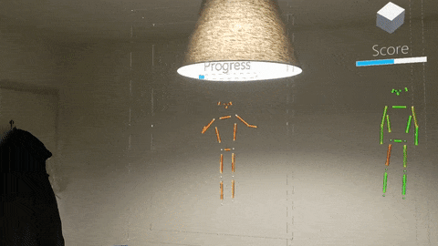
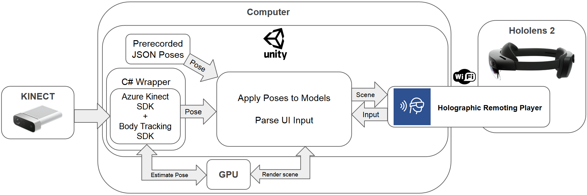
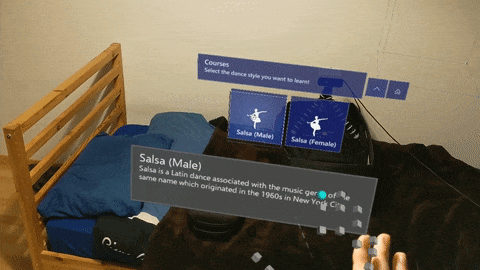
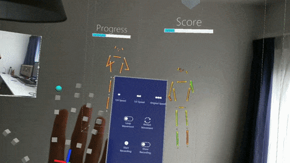
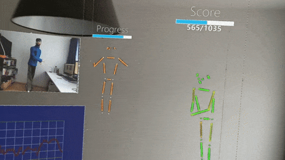

# MR Motion Instructor
[**Report**][report-link] | [**Presentation**][presentation-link] | [**Video**][video-link]

[report-link]: https://drive.google.com/file/d/1_MNpdT8GBWdvsy8UoUCX1AudPGPk2mM0/view?usp=sharing
[presentation-link]: https://drive.google.com/file/d/1Tdgr7TpSHI3s6lD8M-23Ves3paCuMY5g/view?usp=sharing
[video-link]: https://drive.google.com/file/d/12SufbJpmwGuYedoX1JAJ5AfUv7IJO9HS/view?usp=sharing

Authors:
[Jan Wiegner](https://github.com/janwww), 
[Rudolf Varga](https://github.com/ketjatekos), 
[Felix Pfreundtner](https://github.com/felixpfreundtner), 
[Daniil Emtsev](https://github.com/daniil-777) and 
[Utkarsh Bajpai](https://github.com/Utkarsh-Bajpai)

Project for the course Mixed Reality Lab 2020 at ETH.

Check out the report and video linked above for more detailed information.

### Abstract
Learning complex movements can be a time-consuming process, but it is necessary for the mastery of activities like Karate Kata, Yoga and dance choreographies. 
It is important to have a teacher to demonstrate the correct pose sequences step by step and correct errors in the student’s body postures.
In-person sessions can be impractical due to epidemics or travel distance, while videos make it hard to see the 3D postures of the teacher and of the students. 
As an alternative, we propose the teaching of poses in Augmented Reality (AR) with a virtual teacher and 3D avatars.
The focus of our project was on dancing, but it can easily be adapted for other activities.

### Architecture

Our main method of pose estimation is using the Azure Kinect with the Sensor SDK and Body tracking SDK 
and we use the official C# wrapper to connect it to Unity.
We rely on Microsoft’s 
[Holographic Remoting Player](https://docs.microsoft.com/en-us/windows/mixed-reality/develop/platform-capabilities-and-apis/holographic-remoting-player) 
to display content on the Hololens 2 which is being run and rendered on a separate computer.

### Learning Motion in MR

The user has an option of following a guided course, which consisits of repeating basic steps to perfect them and testing their skills on choreographies.
They can also use freeplay mode to beat their previous highest score.

There are a multitude of visualization options, so the user can change the environment to their own needs and accelerates the learning process.
This includes creating multiple instances of his avatar and the one of the teacher, mirroring them, showing a graph of the score, a live RGB feed from the kinect and others.
Changes can be either done in the main menu or trough the hand menu for smaller changes.

Our scoring mechanism is explained in our [report][report-link].

### Avatars

There are 4 avatar options to choose from in our project: 
- Cube avatar (position and orientation of all estimated joints)
- Stick figure avatar (body parts used for score calculation, changing color depending on correctness)
- Robot avatar (rigged model)
- SMPL avatar models (parametized rigged model)

## Environment
As of January 24, 2021, this repository has been tested under the following environment:
- Windows 10 Education (10.0.19042 Build 19042)
- [All tools required to develop on the Hololens](https://docs.microsoft.com/en-us/windows/mixed-reality/install-the-tools)
- Unity 2019.4.13f1 // Unity 2019 LTS version

 A dedicated CUDA compatible graphics card is necessary, NVIDIA GEFORCE GTX 1070 or better. For more information consult the 
 [official BT SDK hardware requirements](https://docs.microsoft.com/en-us/azure/kinect-dk/system-requirements). 
 We used a GTX 1070 for development and testing.

## Get Started
1. Clone this repository.
2. Setup the Azure Kinect Libraries: (same as [Sample Unity Body Tracking Application](https://github.com/microsoft/Azure-Kinect-Samples/tree/master/body-tracking-samples/sample_unity_bodytracking))
    1. Get the latest nuget packages of libraries:
        - Open the Visual Studio Solution (.sln) associated with this project. You can create one by opening the project in Unity Editor and opening a csharp file.
        - In Visual Studio open: Tools->NuGet Package Manager-> Package Manager Console
        - Exectue in the console: `Install-Package Microsoft.Azure.Kinect.BodyTracking -Version 1.0.1`
    2. Move libraries to correct folders:
        - Execute the file `unity/MoveLibraryFile.bat`. You should now have library files in `unity/` and in the newly created `unity/Assets/Plugins`.
3. Open the `unity` folder as a Unity project, with `Universal Windows Platform` as the build platform. It might take a while to fetch all packages.
4. Open `Assets/PoseteacherScene`.
5. When prompted to import TextMesh Pro, select `Import TMP Essential Resources`. You will need to reopen the scene to fix visual glitches.
6. Connect to the Hololens with [Holographic Remoting](https://microsoft.github.io/MixedRealityToolkit-Unity/Documentation/Tools/HolographicRemoting.html#connecting-to-the-hololens-with-wi-fi) (using the `Windows XR Plugin Remoting` in Unity).
7. Click play inside the Unity editor.

### Notes
- Most of the application logic is inside of the `PoseteacherMain.cs` script which is attached to the `Main` game object.
- If updating from an old version of the project, be sure to delete the `Library` folder generated by Unity, so that packages are handled correctly. 
- The project uses MRTK 2.5.1 from the Unity Package Manager, not imported into the `Assets` folder: 
   - MRTK assets have to be searched inside `Packages` in the editor.
   - The only MRTK files in `Assets` should be in folders `MixedRealityToolkit.Generated` and `MRTK/Shaders`. 
   - Only exception is the `Samples/Mixed Reality Toolkit Examples` if [MRTK examples are imported](https://microsoft.github.io/MixedRealityToolkit-Unity/Documentation/usingupm.html#using-mixed-reality-toolkit-examples)
   - If there are other MRTK folders, they are from an old version of the project (or were imported manually) and [should be removed like when updating](https://microsoft.github.io/MixedRealityToolkit-Unity/Documentation/Updating.html). 
     Remeber to delete the `Library` folder after doing this.
- We use the newer XR SDK pipeline instead of the Legacy XR pipeline (which is depreciated)

## How to use
- It is recommended to use the UI to navigate in the application.
- For debugging we added the following keyboard shortcuts:
   - H for toggling Hand menu in traing/choreography (for use in editor testing)
   - O for toggling pause of teacher avatar updates
   - P for toggling pause of self avatar updates
   - U for toggling force similarity update (even if teacher updates are paused)

## License

All our code and modifications are licensed under the attached MIT License. 

We use some code and assets from:
-  [This fork](https://github.com/Aviscii/azure-kinect-dk-unity) of the [azure-kinect-dk-unity repository](https://github.com/curiosity-inc/azure-kinect-dk-unity) (MIT License).
- [NativeWebSocket](https://github.com/endel/NativeWebSocket) (Apache-2.0 License). 
- [SMPL](https://smpl.is.tue.mpg.de/) (Creative Commons Attribution 4.0 International License). 
- [Space Robot Kyle](https://assetstore.unity.com/packages/3d/characters/robots/space-robot-kyle-4696) (Unity Extension Asset License). 
- [Lightweight human pose estimation](https://github.com/Daniil-Osokin/lightweight-human-pose-estimation-3d-demo.pytorch) (Apache-2.0 License). 
- [Official Sample Unity Body Tracking Application](https://github.com/microsoft/Azure-Kinect-Samples/tree/master/body-tracking-samples/sample_unity_bodytracking) (MIT License)

## Alternative pose estimation (experimental)

We show an example of using the Websockets for obtaining the pose combined with the [Lightweight human pose estimation](https://github.com/Daniil-Osokin/lightweight-human-pose-estimation-3d-demo.pytorch) repository. If you do not have an Azure Kinect or GPU you can use this, but it will be very slow. 

Clone the repository and copy `alt_pose_estimation/demo_ws.py` into it. Install the required packages according to the repository and run `demo_ws.py`. Beware that Pytorch still has issues with Python 3.8, so we recommend using Python 3.7. It should now be sending pose data over a local Websocket, which can be used if the `SelfPoseInputSource` value is set to `WEBSOCKET` for the `Main` object in the Unity Editor. Depending on the version of the project, some changes might need to be made in `PoseInputGetter.cs`.